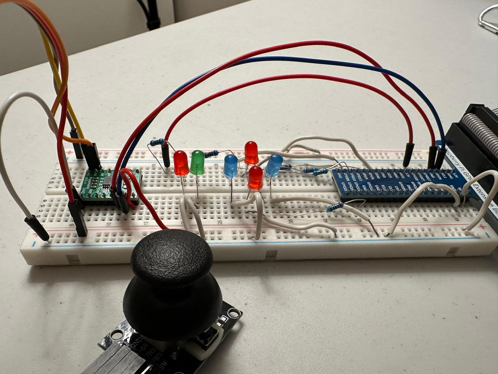
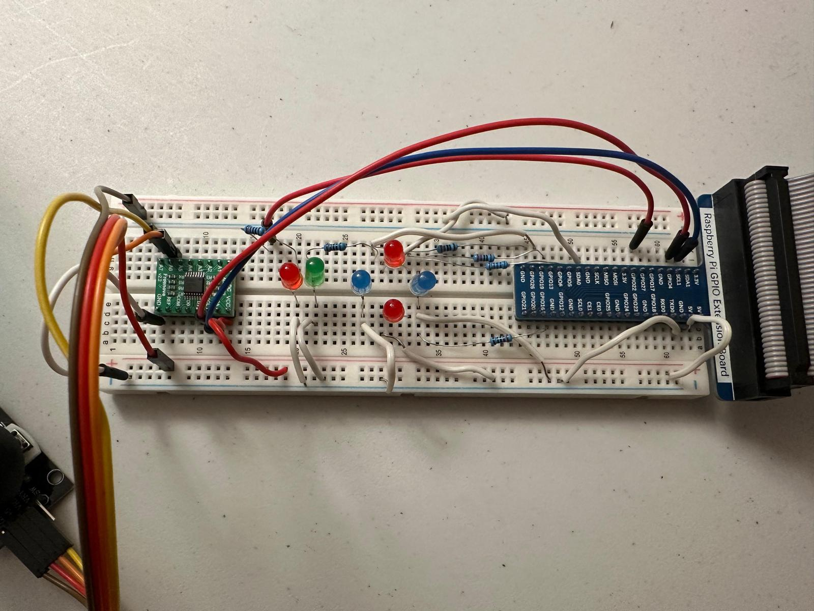
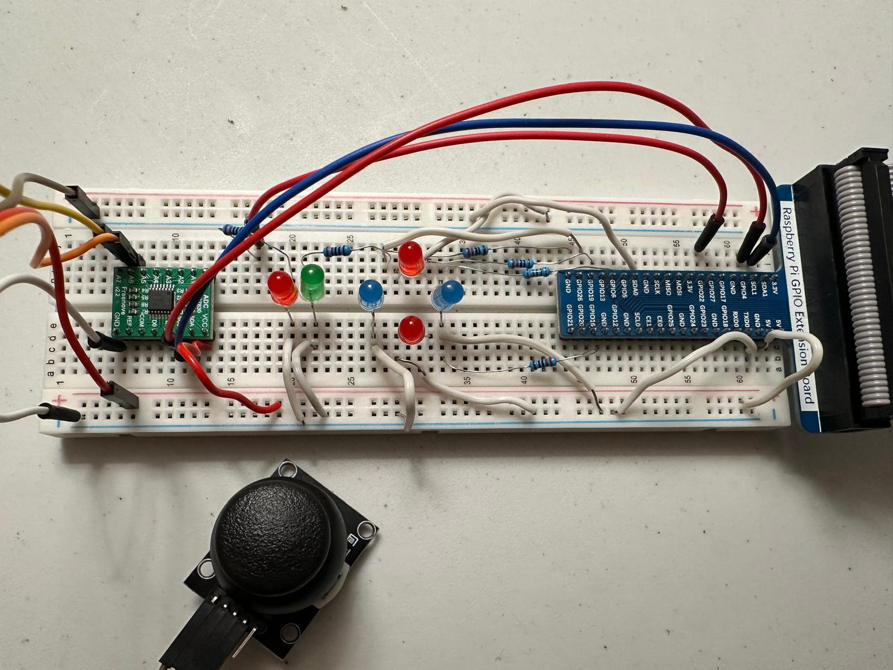

# Smart-Lock-System

## Overview

This Python script implements a joystick-controlled lock system using a Raspberry Pi. The script reads joystick movements via an ADS7830 ADC and controls PWM LEDs based on the input. It also includes a basic access control mechanism that grants or denies access based on user input.

## Features

- Reads joystick input using the ADS7830 ADC.
- Controls PWM LEDs based on joystick movement.
- Simple access control mechanism based on user input.
- Graceful shutdown handling using signal trapping.

## Hardware Requirements

- Raspberry Pi
- ADS7830 ADC
- Joystick module
- PWM LEDs connected to GPIO pins:
  - Top: GPIO 5
  - Right: GPIO 20
  - Bottom: GPIO 26
  - Left: GPIO 13
  - Access granted LED: GPIO 19
  - Access denied LED: GPIO 27

## Installation

1. Ensure Python 3 is installed on your Raspberry Pi.
2. Install required dependencies:
   ```sh
   sudo apt update
   sudo apt install python3-gpiozero python3-smbus
   ```
3. Connect the joystick module and LEDs according to the specified GPIO pins.
4. Clone this repository and navigate to the project directory:
   ```sh
   git clone <repository_url>
   cd <repository_name>
   ```

## Usage

1. Run the script using:
   ```sh
   python3 script.py
   ```
2. The system will monitor joystick movements and control LEDs accordingly.
3. If the joystick is moved in the top direction, the system will prompt for user input:
   - Press 'y' to unlock (access granted, LED on GPIO 19 blinks).
   - Press 'n' to deny access (LED on GPIO 27 blinks).
4. The script can be stopped using `CTRL+C`.

### Demo & Images



[Watch the Vimeo Video](https://vimeo.com/1059506181?share=copy#t=0)


## Code Structure

- ``: Reads joystick input via the ADS7830 ADC.
- ``: Filters minor fluctuations in joystick readings.
- ``: Reads joystick movement values.
- ``: Handles graceful shutdown.
- ``: Handles user access decision.

## License

This project is open-source and licensed under the MIT License.

## Author

Govind Santhosh

